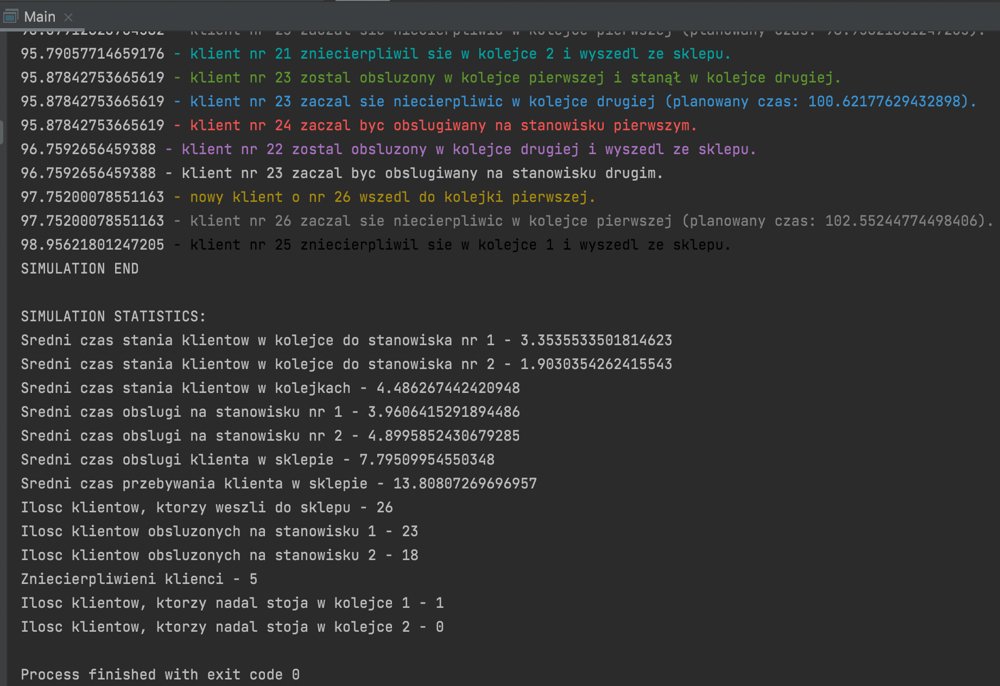
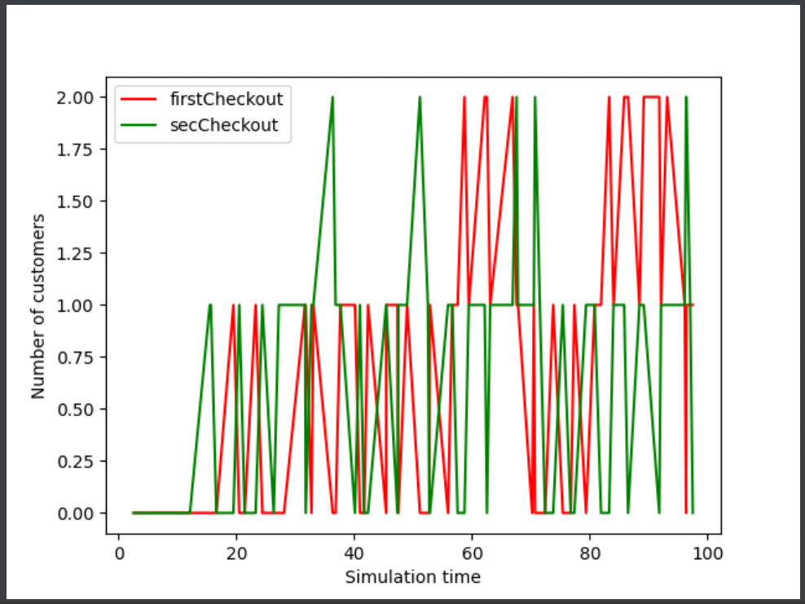

# Simulation of queues in a store
## Table of contents
* [General info](#general-info)
* [Examples of usage](#usage)

## General info
A project that simulates a store where customers go through two queues (LIFO and FIFO) based on an event-driven simulation engine. Customers can become impatient and leave the store immediately.
	
## Usage
### Logs and statistics

### Plot

